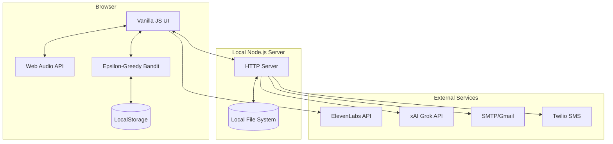
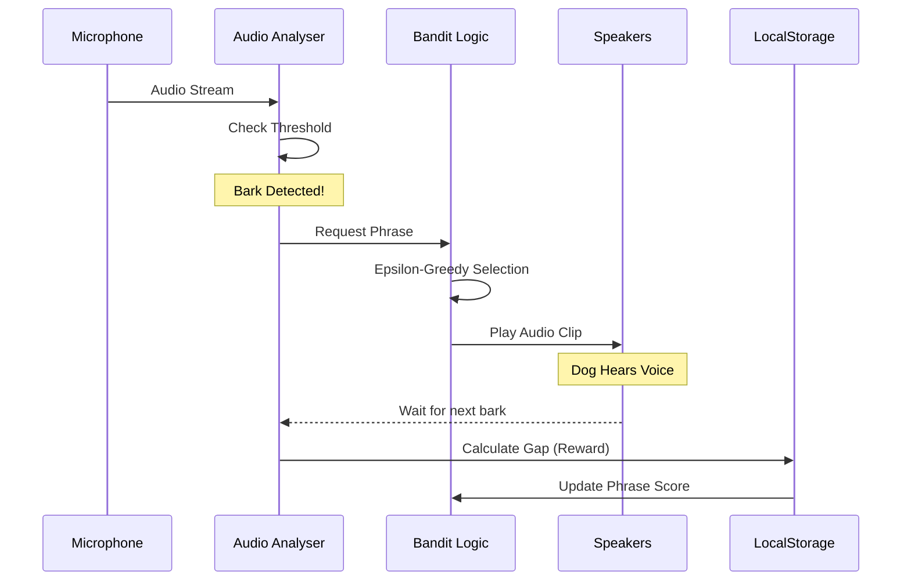

# System Patterns: Dog Calm-Down

## Architecture

The system follows a **Client-Server architecture** where the heavy lifting of audio processing and decision-making happens in the browser, and the server acts as a notification gateway.

## Key Algorithms & Patterns

### $\varepsilon$-Greedy Multi-Armed Bandit
Used to optimize phrase selection:
- **Exploration ($\varepsilon = 0.15$)**: 15% of the time, a random phrase is played to discover if it has become more effective.
- **Exploitation**: 85% of the time, the phrase with the highest average "reward" is played.
- **Reward Function**: The reward is the time elapsed (gap) between the current bark and the previous bark. Longer gaps indicate a more effective calming phrase.

### Audio Processing Pattern
- **Bark Detection**: Calculates the average volume level from the frequency data. If the level exceeds a user-defined threshold, a bark is triggered.
- **Pitch Detection**: Uses a basic peak-finding algorithm in the frequency domain to estimate the bark's pitch.
- **Dynamic Playback**: Implements a sine-wave volume oscillation during playback to make the voice sound more natural/less robotic.

## Data Flow

1. **Detection**: Mic $\rightarrow$ Analyser $\rightarrow$ Threshold Check $\rightarrow$ Bark Event.
2. **Action**: Bark Event $\rightarrow$ Bandit Selection $\rightarrow$ Audio Playback.
3. **Learning**: Next Bark $\rightarrow$ Calculate Gap $\rightarrow$ Update Bandit Score $\rightarrow$ Save to `localStorage`.
4. **Reporting**: Schedule/Manual Trigger $\rightarrow$ Build Payload (including Chart PNG) $\rightarrow$ POST to `/report` $\rightarrow$ Email/SMS.
