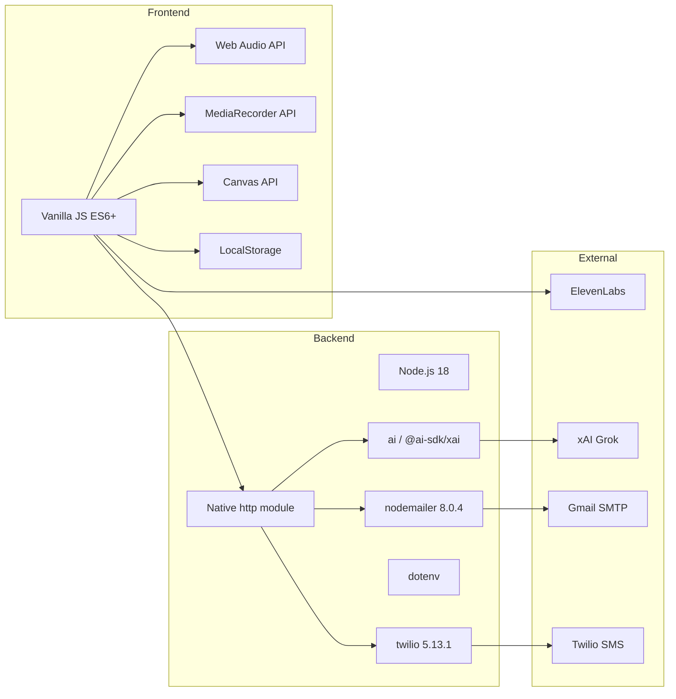

# Tech Context: Dog Calm-Down

## Technology Stack

## Dependency Versions
- **Node.js**: 18 (Pinned in Dockerfile)
- **nodemailer**: 8.0.4 (Pinned)
- **twilio**: 5.13.1 (Pinned)

## Key Technical Decisions
- **Vanilla JS**: Minimal overhead, direct API access.
- **Client-Side Audio**: Low latency, privacy.
- **$\varepsilon$-Greedy Bandit**: Simple RL for phrase optimization.
- **Local Node Server**: Required for SMTP/SMS gateway.